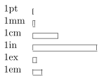

# Sizes

## Units

Available size units used for descript how something should be sized.

- `pt` - [1](#Footnotes)a point is approximately 1/72.27 inch, that means about
0.0138 inch or 0.3515 mm (exactly point is defined as 1/864 of American printer’s
foot that is 249/250 of English foot)  
- `mm` - millimeter  
- `cm` - centimeter  
- `in` - inch  
- `ex` - height of a lowercase `x` in the current font.  
- `em` - width of an uppercase 'M' in the current font.  
- `mu` - Special usages [1](#Footnotes)math unit equal to 1/18 em,
where em is taken from the math symbols family.  

## Lengths

Spacing lengths for describing space in the document[2](#Footnotes)[2](#Footnotes)

- `\baselineskip` - Vertical distance between lines in a paragraph
- `\columnsep` - Distance between columns
- `\columnwidth` - The width of a column
- `\evensidemargin` - Margin of even pages, commonly used in two-sided documents such as books
- `\linewidth` - Width of the line in the current environment.
- `\oddsidemargin` - Margin of odd pages, commonly used in two-sided documents such as books
- `\paperwidth` - Width of the page
- `\paperheight` - Height of the page
- `\parindent` - Paragraph indentation
- `\parskip` - Vertical space between paragraphs
- `\tabcolsep` - Separation between columns in a table (tabular environment)
- `\textheight` - Height of the text area in the page
- `\textwidth` - Width of the text area in the page
- `\topmargin` - Length of the top margin

### Footnotes

[1] - Descriptions from https://www.sharelatex.com/learn/Lengths_in_LaTeX#Units
[2] - Descriptions form https://www.sharelatex.com/learn/Lengths_in_LaTeX#Lengths